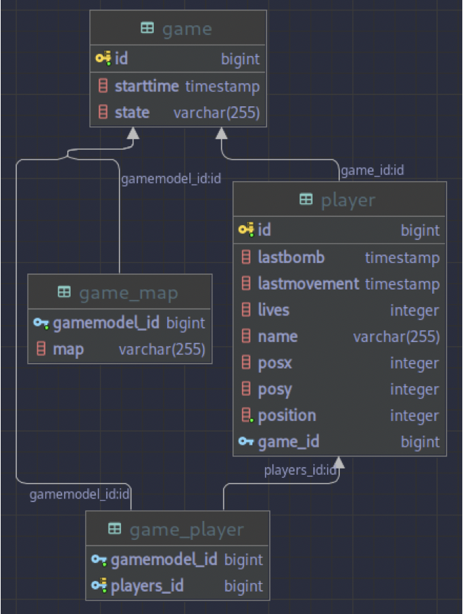

# BombermanBackend

The goal of this project was to create the backend of an online Bomberman game.
I implemented multiple `REST endpoints` for the client to communicate with the backend.
Those endpoints were are all defined in a Swagger document given in YAML format.

I tested my code in two different ways :

• Architecture tests: 
  the architecture of the project follows a strict `layered architecure`, which is a is a staple of backend development.

• API tests: 
  I made sure The backend send proper responses to requests following the predefined `JSON format` in the swagger document.
  
The following diagram is an example of the database that you can implement in this project.

